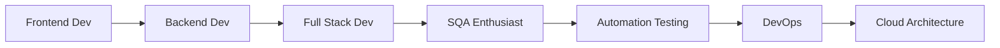

<h1 align="center">🚀 Faruk Badsha</h1>
<h3 align="center">Full Stack Developer | Software Quality Assurance (SQA) Enthusiast</h3>

  

  
  
  

---

## 🧑‍💻 About Me

I'm a passionate **Full Stack Web Developer** and **SQA Enthusiast** from Bangladesh 🇧🇩. I love building robust, scalable, and user-friendly web applications. With a strong focus on code quality and software testing, I ensure that every product I deliver meets the highest standards of performance and reliability.

- 🔭 I’m currently working on **MERN Stack E-Commerce Platform**
- 🌱 I’m currently learning **Next.js, TypeScript & SQA Automation**
- 🧪 Exploring **Software Testing Life Cycle (STLC) & Test Automation**
- 💬 Ask me about **React, Node.js, MongoDB, Express, SQA**
- 🎯 Goal: **Become a Full Stack Developer + SQA Specialist**
- 

---

## 🛠️ Technical Skills

### 🚀 Frontend Development

  
  
  
  
  
  
  
  
  
  
  

### ⚙️ Backend Development

  
  
  
  
  
  
  
  

### 🗄️ Database

  
  
  
  

### 🧪 Software Quality Assurance (SQA)

  
  
  
  
  
  
  
  
  

### 🛠️ DevOps & Tools

  
  
  
  
  
  
  
  
  
  

---

## 📊 GitHub Analytics

  
  

  

---

## 🏆 GitHub Trophies

  

---

## 📈 Contribution Graph

  

---

## 🧪 SQA Expertise

  <table>
    <tr>
      <td><b>📝 Test Planning</b></td>
      <td><b>🧪 Test Case Design</b></td>
      <td><b>🔄 Test Execution</b></td>
    </tr>
    <tr>
      <td><b>🐛 Bug Reporting</b></td>
      <td><b>🤖 Test Automation</b></td>
      <td><b>📊 Performance Testing</b></td>
    </tr>
    <tr>
      <td><b>🔒 Security Testing</b></td>
      <td><b>📱 Mobile Testing</b></td>
      <td><b>🌐 API Testing</b></td>
    </tr>
  </table>

### 🎯 SQA Skills:
- ✅ **Software Testing Life Cycle (STLC)**
- ✅ **Test Case Design Techniques** (Equivalence Partitioning, Boundary Value Analysis)
- ✅ **Defect Life Cycle & Bug Tracking** (JIRA, Trello)
- ✅ **Functional & Non-Functional Testing**
- ✅ **Agile & Scrum Methodologies**
- ✅ **Test Automation Framework** (Selenium with Python/Java)
- ✅ **API Testing** (Postman, REST Assured)
- ✅ **Performance Testing** (JMeter)
- ✅ **Cross-Browser & Cross-Platform Testing**

---

## 📌 Featured Projects

### 🛍️ Full Stack E-Commerce Platform
> Complete e-commerce solution with user frontend, admin panel, and RESTful API
- **Tech:** React, Node.js, Express, MongoDB, Tailwind CSS, SSLCommerz, Cloudinary
- **Features:** Auth, Cart, Orders, Payment, Admin Dashboard, File Upload
- [🔗 Live Demo](https://your-ecommerce-demo.com) | [📂 Repository](https://github.com/FarukBadsha0186/ecommerce_frontend_-_backend)

### 📰 MERN News Portal
> Full stack news portal with user authentication and news CRUD operations
- **Tech:** React, Node.js, Express, MongoDB, JWT, Vite
- **Features:** User Registration, Login, News Create/Read, Authorization
- [🔗 Live Demo](https://news-portal-etom.onrender.com/) | [📂 Repository](https://github.com/FarukBadsha0186/news-portal)

### 🧪 SQA Test Automation Framework
> Test automation framework for web applications using Selenium and Python
- **Tech:** Python, Selenium WebDriver, PyTest, Allure Reports
- **Features:** Page Object Model, Data-Driven Testing, Cross-Browser Testing
- [📂 Repository](https://github.com/FarukBadsha0186/sqa-automation-framework)

---

## 📬 Connect with Me

  
  
  
  
  
  

---

## 🎯 Current Focus

- 🔹 Building **Full Stack E-Commerce Platform** with MERN Stack
- 🔹 Learning **Next.js & TypeScript** for modern web development
- 🔹 Exploring **Test Automation** with Selenium & Cypress
- 🔹 Enhancing **SQA Skills** & contributing to open-source testing tools
- 🔹 Preparing for **ISTQB Certification**

---

## 📖 Learning Journey

---

## 📊 Weekly Stats

  

---

## 💬 Random Dev Quote

  

---

## 📱 Support My Work

  
  

---

  <b>💻 "Quality is not an act, it is a habit." - Aristotle</b>
   
   
  <i>⭐ Thanks for visiting my profile! Let's connect and build something amazing together! 🚀</i>
   
   
  

